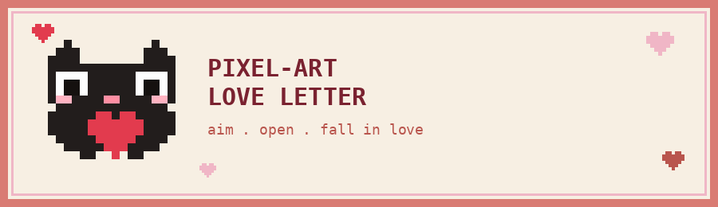

<p align="center">
  
</p>
 
<h1 align="center">Pixel-Art Love Letter 🏹💌</h1>

<p align="center">
  An interactive, gamified "monthsary" web card — aim Cupid's bow to open the letter, flip through a pixel-art photo gallery, and unlock a playful yes/no finale.
</p>

<p align="center">
  <a href="https://pixel-love-letter.netlify.app/"></a>
  
  
  
  
</p>

<p align="center">
  <strong>🔗 Live Demo:</strong> <a href="https://pixel-love-letter.netlify.app/">pixel-love-letter.netlify.app</a>
</p>

---

> **Privacy note:** This is the public, GitHub-safe version of a commissioned personal gift site. All real photos and background music from the original delivery have been removed, and personal names were replaced with generic placeholders — see [Privacy & Content](#-privacy--content) below.

---

## 📑 Table of Contents

- [Features](#-features)
- [How It Works](#-how-it-works)
- [Project Structure](#-project-structure)
- [Customize Your Content](#%EF%B8%8F-customize-your-content)
- [Adding Your Own Media](#-adding-your-own-media)
- [Logo & Favicon](#-logo--favicon)
- [Run Locally](#-run-locally)
- [Privacy & Content](#-privacy--content)
- [License](#-license)
- [Author](#-author)

---

## ✨ Features

- 🏹 **Aim-and-shoot mini-game** — pull back a bow and fire an arrow at an envelope to open the letter (mouse, touch, or spacebar)
- 🐱 A hand-drawn pixel-art cat sprite rendered on `<canvas>`
- 💌 A retro "OS window" letter card, complete with a fake titlebar and window buttons
- 🖼️ A hidden **photo gallery** that reveals itself after the letter is opened, with click-to-flip photos
- ✅❌ A cheeky **YES / NO** button pair — the NO button dodges the cursor
- 🎊 Confetti and heart-burst effects on interaction
- 🎵 Toggleable background music
- 📱 Fully responsive, touch-friendly interactions

---

## 🕹️ How It Works

1. The visitor lands on an "aim" screen and pulls back a bow aimed at a sealed envelope.
2. A successful hit plays a hit animation and opens a pixel-styled letter window.
3. The letter reveals a title, an animated cat, and (once triggered) a photo gallery.
4. Clicking **YES** celebrates with confetti and hearts; **NO** playfully dodges away from the cursor.
5. A final message closes out the experience.

All of the animation, hit-detection, and state logic lives in `love.js`; visuals and the pixel-art aesthetic are in `love.css`.

---

## 📂 Project Structure

```text
pixel-love-letter/
├── index.html            # Page structure: aim stage, letter window, gallery, buttons
├── love.css               # Pixel-art styling, animations, responsive layout
├── love.js                 # Bow/arrow physics, hit detection, gallery, confetti, music
├── favicon.png              # Pixel-art cat favicon (matches the in-page cat sprite)
├── readme-banner.png         # Banner used at the top of this README
├── textures/
│   └── grain.png            # Background grain texture (design asset, not personal media)
└── background-music.mp3    # ⚠️ removed for privacy — add your own (see below)
```

> `background-music.mp3` and all `photoN.jpg` files were removed from this repository. `index.html` still references them by filename — add your own files with matching names to restore the full experience.

---

## ✍️ Customize Your Content

Most of the personal text lives directly in `index.html` and `love.js`:

- Title text: search `index.html` for `Happy 2 months, my love` and the matching line in `love.js`.
- Window titlebar label: `FROM YOU.EXE` in `index.html` — change to whatever name/label you like.
- Gallery caption and photo `alt` text: in the `.gallery` block in `index.html`.

---

## 🖼️ Adding Your Own Media

### Photos
Add six images to the project root named:
```
photo1.jpg ... photo6.jpg
```

### Music
Add a file named:
```
background-music.mp3
```
to the project root. The `<audio>` element in `index.html` already points to this filename — replace the src there if you'd rather use a different filename or a hosted URL.

---

## 🐱 Logo & Favicon

`favicon.png` is a pixel-art cat generated straight from the same 16×16 sprite grid (`CAT_IDLE`) used for the animated cat in `love.js`, so it matches the in-page character exactly. `readme-banner.png` uses the same sprite plus the site's own color palette (`--cream`, `--coral`, `--pink`, `--maroon` from `love.css`).

- `index.html` already links it: `<link rel="icon" type="image/png" href="./favicon.png" />`
- To swap in your own logo, just replace `favicon.png` with any square image (128×128 or larger recommended).
- Want a different pixel-art mascot? Edit the `CAT_IDLE` grid in `love.js` (each character maps to a color in the `PAL` palette) — a matching favicon/banner can be regenerated from the same grid.

---

## ▶️ Run Locally

This is a fully static site — no build step or server required.

- Double-click `index.html` to open it directly in a browser, **or**
- Serve it locally for a closer-to-production experience:
```bash
python -m http.server 5500
```
Then open `http://localhost:5500`.

---

## 🔐 Privacy & Content

This repository is the **sanitized, shareable version** of a commissioned personal project. Before publishing:

- All original photos (`photo1.jpg`–`photo6.jpg`) and the background music file were **removed**.
- The recipient's pet name was replaced with generic placeholders (`my love`).
- The sender label was genericized to `FROM YOU.EXE`.

If you're using this as a template, drop in your own photos and music using the filenames above, and personalize the title text.

---

## 📄 License

Personal/portfolio project. Feel free to use this as a learning reference or starting template; if you plan to redistribute or resell it, please contact the author first.

---

## 👤 Author

**Christian G. Maranan**
Computer Engineering Student — Major in Machine Learning
at Tanauan City College

- **GitHub:** [@krei-labs](https://github.com/krei-labs)
- **Instagram:** [@krei_in](https://instagram.com/krei_in)
- **Email:** [christianmaranan0303@gmail.com](mailto:christianmaranan0303@gmail.com)

---

<p align="center"><strong>Build. Learn. Experiment.</strong> — kréi / Krei Labs</p>
